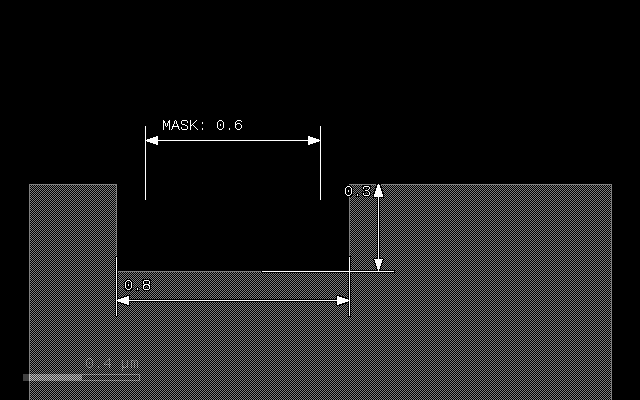
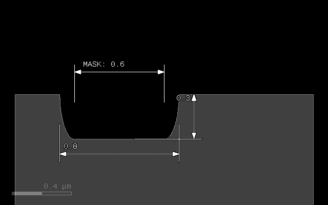
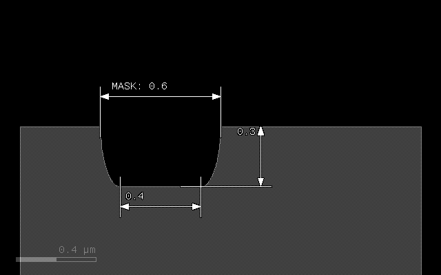
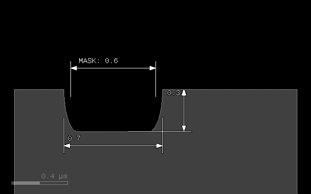
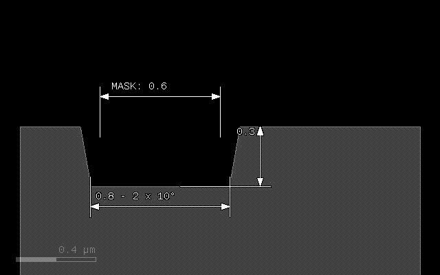
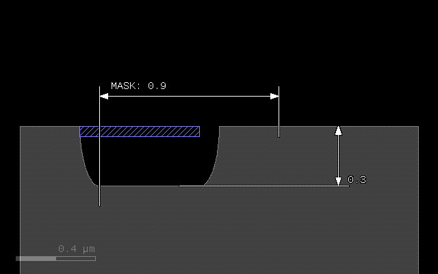
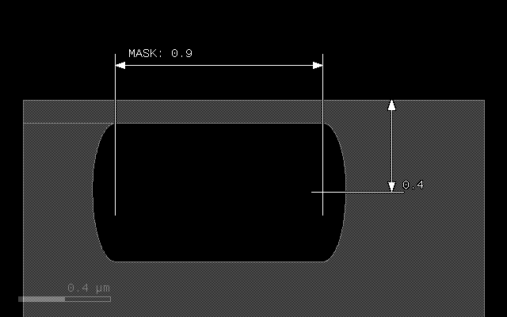

# <tt>etch</tt> method

The etch method is one of the basic methods for describing a process. It is called on a mask data object. The basic use case is:

```ruby
l1 = layer("1/0")
substrate = bulk
mask(l1).etch(0.3, :into => substrate)
output("1/0", substrate)
```

This simple case removes material from the substrate and leaves a hole where the mask is drawn.. 

The etch method has up to two arguments and a couple of options which have to be put after the arguments in the usual Ruby fashion, using the notation ":name => value":

<tt>etch(</tt>height<tt>, </tt>lateral<tt>, </tt> options ...<tt>)</tt>

The height argument is mandatory and specifies the depth of the etch. The lateral parameter specifies the lateral extension (underetch). The lateral extension is optional and defaults to 0. The lateral extension can be negative. In that case, the profile will be aligned with the mask at the top. Otherwise it is aligned at the bottom.

There are several options:

| Option | Value       |
| ------ | ----------- |
| :mode  | The profile mode. Can be :round, :square and :octagon. The default is :square. |
| :taper | The taper angle. This option specifies tapered mode and cannot be combined with :mode. |
| :bias  | Adjusts the profile by shifting it to the interior of the figure. Positive values will reduce the line width by twice the value. |
| :into  | A material or an array of materials into which the etch is performed. This specification is mandatory. |
| :through | A material or an array of materials which form the selective material of the etch. The etch will happen only where this material interfaces with air and pass through this material (hence the name). |
| :buried | Applies the etching at the given depth below the surface. This option allows to create cavities. It specifies the vertical displacement of the etch seed and there may be more applications for this feature. |

## <tt>:mode</tt>, <tt>:taper</tt> and <tt>:bias</tt> 

The effect of the mode and bias interaction is best illustrated with some examples.

The initial layout is always this in all following examples:


The first example if the effect of the plain etch with a thickness of 0.3. It will remove a rectangular part at the mask:

```ruby
etch(0.3, :into => substrate)
```


The next example illustrates the effect of a lateral extension on a square profile. The 0.1 extension will remove material left and right of the main trench:

```ruby
etch(0.3, 0.1, :into => substrate)
```



In "round" mode, the material will be removed with an elliptical profile. The vertical axis will be 0.3, the horizontal 0.1 representing the laternal extension. The trench will become bigger than the mask by the lateral extension at the bottom:

```ruby
etch(0.3, 0.1, :mode => :round, :into => substrate)
```



To avoid overetch, a negative lateral extension can be specified, resulting in a alignment of patch and mask at the top:

```ruby
etch(0.3, -0.1, :mode => :round, :into => substrate)
```



Another mode is "octagon" which is basically a coarse approximation of the ellipse and computationally less expensive:

```ruby
etch(0.3, 0.1, :mode => :octagon, :into => substrate)
```


A bias value can be specified to fine-tune the position of the top edge of the trench. A *positive* bias value will *shrink* the figure:

```ruby
etch(0.3, 0.1, :mode => :round, :bias => 0.05, :into => substrate)
```



A special profile can be specified with the :taper option. This option specifies a taper angle and a conical trench will be created. The taper angle will be the sidewall angle of the trench. This option cannot be combined with :mode and the lateral extension should be omitted. It can be combined with :bias however:

```ruby
etch(0.3, :taper => 10, :into => substrate)
```


```ruby
etch(0.3, :taper => 10, :bias => -0.1, :into => substrate)
```



## Step etch profile

The following image shows the etch profile of a 30° slope and a vertical step by an etch in round mode with thickness of 0.3 and lateral extension of 0.1. The sidewall of the step will be removed with a thickness of 0.1 corresponding to the lateral extension.

The solid gray line shows the profile before the etch:

```ruby
etch(0.3, 0.1, :mode => :round, :into => substrate)
```


## <tt>:through</tt> - selective etch 

Normally the etch will happen only at the interface between air and the "into" material, as the following example demonstrates:

```ruby
# Prepare input layers
m1 = layer("1/0")
m2 = layer("2/0")

substrate = bulk

# Grow a stop layer
stop = mask(m2).grow(0.05, :into => substrate)

# Grow with mask m1, but only where there is a substrate surface
mask(m1).etch(0.3, 0.1, :mode => :round, :into => substrate)

# output the material data to the target layout
output("0/0", substrate)
output("2/0", stop)
```

With the following input:


This script will produce the following result:


The blue material will prevent etching as it blocks the air/substrate interface. The "through" options reverses that scheme: giving this "stop" material as an argument to "through" will make the etch happen at places where this material interfaces with air:

```ruby
# Prepare input layers
m1 = layer("1/0")
m2 = layer("2/0")

substrate = bulk

# Grow a stop layer
stop = mask(m2).grow(0.05, :into => substrate)

# Grow with mask m1, but only where there is a substrate surface
mask(m1).etch(0.3, 0.1, :mode => :round, :into => substrate, :through => stop)

# output the material data to the target layout
output("0/0", substrate)
output("2/0", stop)
```

This script will produce the following result:



## <tt>:buried</tt> - vertically displaced etch

This option shifts the seed of the etch operation into the material. Without this option, the etch will start at the surface. If a positive value is given, the etch starts below the surface in a depth given by this value. The etch will proceed upwards and downwards with the given features. In the extreme case (below the surface by more than the etch depth), this feature creates cavities:

```ruby
# Prepare input layers
m1 = layer("1/0")
m2 = layer("2/0")

substrate = bulk

# Grow with mask m1 into the substrate
mask(m1).etch(0.3, 0.1, :mode => :round, :into => substrate, :buried => 0.4)

# output the material data to the target layout
output("0/0", substrate)
```

With the following input:


This script will produce the following result:



